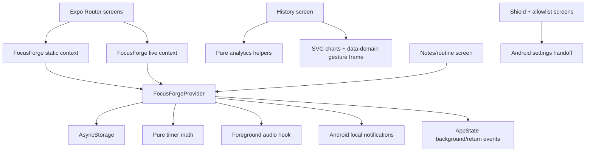

# FocusForge: Complete AI and Developer Handoff Guide

**Status:** Local-first Expo/React Native study-focus application, prepared for Android internal testing and a future Google Play submission.  
**Primary platform:** Android; web preview is for development only.  
**Checkpoint reference:** Consult the managed project version history for the newest checkpoint. This guide is maintained alongside the current source and validation results.  
**Working rule:** Treat this document and the current source code as authoritative. Where older documentation conflicts with the source, prefer the source and update the outdated document in the same change.

> **Purpose.** This guide is intentionally written so that a new developer or AI agent can safely understand, modify, test, and release FocusForge without relying on chat history. It distinguishes implemented behavior from Android-controlled behavior that must be verified on a real installed build.

---

## 1. Product Definition

FocusForge is a **private, local-first study timer**. It combines a configurable focus/rest rhythm, local audible cues, personal goals, subject-aware History analytics, a personal Notes workspace, a seven-day routine planner, and explanatory Android focus-protection guidance.

The default rhythm is deliberately precise:

| Stage | Default duration | Expected cue |
| --- | ---: | --- |
| Study round 1 | 5 minutes | One beep at completion; round 2 begins. |
| Study round 2 | 5 minutes | One beep at completion; round 3 begins. |
| Study round 3 | 5 minutes | One beep at completion; round 4 begins. |
| Study round 4 | 5 minutes | Three beeps at the boundary; 2-minute rest begins. |
| Rest | 2 minutes | One beep at completion; round 1 begins again. |

The user can replace this plan with a custom rhythm. A plan is copied into each active session at launch, which means changing Settings later does **not** retroactively change a running or historical session.

### Explicit product boundaries

FocusForge **does** schedule local Android cue notifications, record when the app moves to the background, provide a local emergency-app checklist, and direct the user to Android settings.

FocusForge **does not** and cannot, as a normal Android app, guarantee selective third-party call filtering, silently allow only selected messaging apps, disable Home/Recents, force DND policy access, or verify audible screen-off cues in Expo Go/web preview. Screen Pinning is Android-owned and can restrict app exits, but it also prevents opening emergency apps until unpinned.

---

## 2. Technology Stack

| Layer | Technology | Responsibility in FocusForge |
| --- | --- | --- |
| Mobile runtime | Expo SDK 54, React Native 0.81, React 19, TypeScript 5.9 | Cross-platform application shell and typed implementation. |
| Routing | Expo Router 6, React Navigation | Tabs, stacked utility screens, hardware-back routing. |
| Local state | React Context split into static and live contexts | Persists data and prevents every screen from re-rendering each timer second. |
| Persistent storage | `@react-native-async-storage/async-storage` | Stores settings, active session, session history, notes, folders, and routines locally. |
| Notifications | `expo-notifications` | Android notification channels and scheduled screen-off cue requests. |
| Foreground audio | `expo-audio` through `use-study-cue-audio` | Immediate in-app cue fallback while the app is active. |
| Android device behavior | `expo-keep-awake`, Android permissions/channels, system settings handoff | Optional screen-awake behavior, DND setup guidance, cue controls. |
| Charts | `react-native-svg`, Gesture Handler, Reanimated | History coordinate charts and data-domain pan/zoom. |
| Gestures | `react-native-gesture-handler`, `react-native-reanimated` | Exclusive pinch/pan interaction on time-based History charts. |
| Advertising | `react-native-google-mobile-ads` with Google UMP consent | Optional compact Focus banner and voluntary rewarded ad on custom Android/iOS builds. |
| Design system | NativeWind/Tailwind configuration plus `StyleSheet` | White/green FocusForge visual language, reusable screen surfaces and controls. |
| Validation | TypeScript, Vitest, Expo Doctor | Static type checks, deterministic domain tests, Expo dependency/configuration checks. |
| Development tooling | `pnpm`, Metro, `tsx`, ESLint, Prettier | Package management, development preview, formatting, and scripts. |

### Important dependencies that are present but not central to the client product

The template includes Express, tRPC, Drizzle, MySQL, OAuth, TanStack Query, and related server utilities. **The FocusForge feature set currently does not require a backend or account.** Do not introduce server storage, analytics, or authentication casually: doing so changes the privacy policy, Google Play Data safety declaration, testing surface, and product promise.

---

## 3. Project Map

```text
focusforge-study-timer/
├── app/
│   ├── _layout.tsx                    # Root providers, stack, Android Back handling
│   ├── (tabs)/
│   │   ├── index.tsx                  # Focus timer and session setup
│   │   ├── history.tsx                # Analytics, precise charts, recent session list
│   │   ├── notes.tsx                  # Notes, folders/tags, routine planner
│   │   ├── shield.tsx                 # Android focus-protection guidance
│   │   ├── settings.tsx               # Rhythm, audio, Android diagnostics, privacy link
│   │   └── _layout.tsx                # Five-tab navigation
│   ├── allowed-interruptions.tsx      # Manual emergency-app checklist and DND guidance
│   ├── rhythm-designer.tsx            # Custom study plan editor
│   └── privacy-policy.tsx             # In-app local-first privacy disclosure
├── components/
│   ├── focusforge-ui.tsx              # Reusable FocusForge surfaces, labels, icon buttons
│   ├── focus-history-charts.tsx       # SVG analytics chart implementations
│   └── interactive-chart-frame.tsx    # Data-domain pan/zoom wrapper
│   ├── focus-ad-space.native.tsx       # Native AdMob banner/rewarded user interface
│   └── focus-ad-space.web.tsx          # Web-preview placeholder; never imports native AdMob code
├── hooks/
│   └── use-study-cue-audio.ts         # Foreground direct audio playback
├── lib/
│   ├── focusforge-core.ts             # Session/settings schemas and timer math
│   ├── focusforge-provider.tsx        # Local storage, live state, actions, app lifecycle
│   ├── focusforge-cue-schedule.ts     # Pure future-cue generator
│   ├── focusforge-notifications.ts    # Android channels and local scheduling
│   ├── focusforge-analytics.ts        # History aggregation and focus-quality advice
│   ├── focusforge-notes.ts            # Notes, folders, tags, and routine normalization
│   ├── focusforge-ad-config.ts         # Test IDs and build-time production unit-ID overrides
│   ├── focusforge-monetization.ts      # Pure twelve-hour ad-free reward calculations
│   ├── chart-time-window.ts            # Precise chart window/tick math
│   └── allowed-interruptions.ts        # Manual emergency-app records and toggles
├── tests/                             # Vitest coverage of domain-level behavior
├── assets/                            # Icons, splash assets, notification sound
├── app.config.ts                      # Expo/Android package, permissions, SDK targets
├── PLAY_STORE_RELEASE_CHECKLIST.md    # Submission and real-device acceptance checklist
├── PLAY_STORE_LISTING.md              # Store copy and asset instructions
├── PRIVACY_POLICY.md                  # Public-policy content to host before submission
└── AI_HANDOFF.md                      # This document
```

---

## 4. Application Architecture



### Context split: performance-critical design decision

`FocusForgeProvider` uses two React contexts:

| Context | Contents | Consumers | Why it exists |
| --- | --- | --- | --- |
| Static context | Settings, session, history, notes, folders, routine, permissions, actions | All feature screens | Changes only when persistent or action data changes. |
| Live context | `now`, computed `snapshot`, `studySummary` | Focus and parts of History | Updates every second without re-rendering Settings, Shield, rhythm designer, or Notes. |

Do **not** merge these contexts without profiling. The split was introduced to reduce broad app/chart lag during active sessions.

---

## 5. Canonical Data Model and Local Storage

All current user data is local. The provider reads persisted JSON at startup, normalizes it, bounds it, and writes updates asynchronously. Storage failures should not interrupt the user’s current in-memory action.

| AsyncStorage key | Primary type | Limit | Purpose |
| --- | --- | ---: | --- |
| `focusforge.settings.v2` | `StudySettings` | — | Rhythm, weekly goal, subject, audio, haptics, keep-awake/bubble preferences, selected locked-screen cue sound, and locally stored `adFreeUntilMs`. |
| `focusforge.active-session.v2` | `ActiveSession \| null` | One | Running/paused session with plan and scheduled cue IDs. |
| `focusforge.history.v1` | `SessionRecord[]` | 100 records | Finished study sessions and timestamps/events. |
| `focusforge.notes.v1` | `PersonalNote[]` | 250 notes | Notes, body, checklist, tags, optional folder, pin state. |
| `focusforge.note-folders.v1` | `NoteFolder[]` | 50 folders | User-created note organization. |
| `focusforge.routine.v1` | `RoutineEntry[]` | 300 blocks | Repeating day-of-week, hour-based routine entries. |
| Allowlist keys | Local manual app records and selection | Implementation-defined | Personal DND setup checklist only; not system enforcement. |

### Essential types

| Type | Fields that matter to future changes |
| --- | --- |
| `StudySettings` | `roundMinutes`, `roundsPerCycle`, `restSeconds`, `weeklyGoalMinutes`, `subjectTag`, `customSubjects`, audio/haptics/awake toggles, `lockedScreenCueSound`, `floatingSessionBubbleEnabled`, `adFreeUntilMs`. |
| `ActiveSession` | Start timestamp, paused duration, pause/interruption counts, event timeline, subject, optional goal, copied `plan`, scheduled notification IDs. |
| `SessionRecord` | Start/end timestamps, focused seconds, completed cycles, pause/interruption metrics, event timeline, subject, optional goal/outcome, plan. |
| `PersonalNote` | Title/body/checklist/pin/folder/tags and creation/update times. |
| `NoteFolder` | Name, approved color, creation time. Deleting it must move contained notes to unfiled rather than delete notes. |
| `RoutineEntry` | Day index (`0` Monday through `6` Sunday), hour, duration, title, optional details, display color. |

### Normalization rules

The pure normalization functions in `lib/focusforge-core.ts` and `lib/focusforge-notes.ts` protect persisted data from stale/bad values. Preserve these rules when adding fields:

* Settings are clamped: rounds are `1–180` minutes, cycle rounds `1–12`, rest `30–3600` seconds, weekly goal `30–10080` minutes.
* A session goal is optional, trimmed, de-duplicated spacing, and limited to 140 characters.
* Event histories are sorted and bounded to 500 items.
* Notes have an 80-character title, 6,000-character body, up to 40 checklist items, and up to 12 normalized tags.
* Folders are capped to 50; notes to 250; routine blocks to 300.
* Routine start hours clamp to `0–23`; block duration to `1–12` hours; weekdays to `0–6`.
* `lockedScreenCueSound` is one of `classic`, `bright`, or `calm`; invalid saved values revert to `classic`. The bubble setting defaults to enabled to preserve the earlier active-session behavior.
* `adFreeUntilMs` must be a non-negative timestamp. A successful rewarded-ad callback grants exactly twelve hours from the current time; no core study feature depends on it.

Whenever a schema changes, write a tolerant normalizer first, update load/save logic, add migration-compatible tests, and keep older records readable.

---

## 6. Study Timer Working Procedure

### Session lifecycle

1. The user optionally types a goal and selects/creates a subject on the **Focus** screen.
2. `startSession(goal)` freezes the current rhythm settings into `ActiveSession.plan`, persists the active session, and schedules Android notifications only when notification permission and sound are enabled.
3. A one-second `now` tick drives `getSessionSnapshot(session, now)`. The calculation derives focus/rest phase from timestamps; it does not decrement a mutable counter.
4. In the foreground, observed round/phase transitions generate direct audio through `useStudyCueAudio`. On a current custom Android build, `startSession()` also waits for the first bounded batch of local notification scheduling to commit before it returns; later cue batches preserve the same canonical timestamps and channels without serially delaying a long custom rhythm.
5. On pause, scheduled cues are cancelled, paused time and a timestamped `pause` event are stored.
6. On resume, pause duration is accumulated and future Android cues are rebuilt.
7. `AppState` records `appLeave` when the active app moves to inactive/background and `interruption` on return. These are analytics observations, not proof that Android blocked another app.
8. On end, the provider computes real focused seconds, persists a `SessionRecord`, clears the active session, and cancels scheduled cues.
9. If the session had a goal, Focus prompts the user to mark it **Completed** or **Partial**; the result is written back to the matching record.

### Timer math

`getSessionSnapshot` calculates elapsed time as:

```text
elapsed = (pausedAt or now) - startedAt - accumulatedPausedDuration
roundSeconds = plan.roundMinutes × 60
focusSeconds = roundSeconds × plan.roundsPerCycle
cycleSeconds = focusSeconds + plan.restSeconds
```

The cycle offset determines whether the session is in a focus round or rest. This timestamp-derived approach allows restoration after a screen lock, process suspension, or app restart, subject to device/OS constraints.

### Cue generation

`getScheduledFocusCues` is the pure source of truth for future OS-level cues. For every cycle inside the default 24-hour scheduling horizon it creates:

* a single cue after all focus rounds except the final round;
* three checkpoint cues at the study/rest boundary, approximately 1.05 seconds apart;
* one restart cue after rest completes.

Do not put scheduling math inside a screen component. Update the pure scheduler and its tests first, then the notification adapter.

---

## 7. Audio, Notifications, Screen Lock, and Android Focus Boundaries

### Two distinct cue systems

| Path | Code | Used for | Limitation |
| --- | --- | --- | --- |
| Foreground cue | `hooks/use-study-cue-audio.ts` | Audible direct cue while FocusForge is open and active. | Not the proof of a screen-off cue. |
| Scheduled local notification | `lib/focusforge-notifications.ts` | Installed Android app with locked display/background delivery. | Depends on Android permission, channel sound, battery policy, exact alarm policy, OEM behavior, and user DND settings. |

The Android notification channels are versioned because Android preserves channel sound behavior after installation. The v4 channel pair is created for the selected **Classic**, **Bright**, or **Calm** bundled sound; each pair requests high importance, public lockscreen visibility, vibration, and DND bypass. A Settings sound change creates/selects a new v4 channel pair and rebuilds future cues for an active unpaused session. Android may still require the user to explicitly allow the channel/override. Screen-off scheduling is explicitly gated to `focusforgeNativeFeaturesVersion: 2`, which is embedded only in the current custom build. Expo Go and an older APK show the update guidance instead of claiming that they can deliver background beeps.

The Settings **Preview** control is intentionally separate from selection: it uses foreground `expo-audio` playback of the requested bundled sound and does not persist or schedule anything. It can therefore help a user choose between Classic, Bright, and Calm before pressing the selection row. Browser preview reports its limitation rather than claiming a sound was heard; the physical Android build remains the correct verification environment.

Pause and resume now update the in-memory timer state and local persistence before Android notification work completes. Cancellation and rescheduling run in a serialized background queue, using only the session’s own scheduled notification identifiers when available. This keeps the primary control responsive while preventing a stale schedule from surviving a pause or session end.

### Android floating session bubble

`modules/session-bubble` is a local Android Expo module. When an unpaused active session backgrounds FocusForge **and Floating session bubble is enabled in Settings**, the provider asks it to create a narrow `TYPE_APPLICATION_OVERLAY` bubble. The bubble computes the current round/rest countdown natively, offers an arrow to relaunch the Focus dashboard, and has an `×` that removes only the overlay—not the study session. Turning the setting off immediately hides an existing bubble; it never pauses or ends the study session.

This feature requires the user to explicitly grant Android’s **Display over other apps** setting from **Focus Shield → Floating session bubble**. It works only in a newly built Android APK/AAB, not Expo Go or web preview. Treat it as user-visible, active-session functionality: do not use it for ads, hidden tracking, app blocking, or unrelated prompts. The `SYSTEM_ALERT_WINDOW` permission requires a fresh binary and Play policy review before public release.

When the user turns **Floating session bubble** on in Settings and overlay permission is missing, the app presents a clear explanation and a deliberate **Open Android settings** action. After Android returns FocusForge to the foreground, it checks the permission again, enables the saved preference only when granted, and otherwise explains that the user can try again later. Do not bypass this user decision or present the Android special-access page for unrelated purposes.

### Advertising and the twelve-hour ad-free reward

The full `FocusAdSpace` implementation remains preserved in `components/focus-ad-space.native.tsx` and `components/focus-ad-space.web.tsx`, but its dashboard import and render are intentionally commented out in `app/(tabs)/index.tsx`. Focus currently shows only a narrow **ADVERTISEMENT SPACE RESERVED** placeholder. To restore monetization, uncomment the marked import and `FocusAdSpace` render in that file; do not recreate or duplicate the SDK logic. On Android/iOS custom builds, the preserved native component obtains advertising consent through Google UMP (`AdsConsent.gatherConsent`), requests ads only after `canRequestAds`, and initializes the Mobile Ads SDK. The optional rewarded action grants **exactly twelve hours** only when the SDK sends `EARNED_REWARD`; `grantAdFreeTime()` persists `adFreeUntilMs = now + 12 hours`. The timer, History, Notes, routine planner, and all focus controls remain usable regardless of advertising state.

The web preview deliberately resolves `focus-ad-space.web.tsx`, a visual test placeholder with no native SDK import. It lets the preview bundle safely but cannot show an actual ad or reward. Expo Go also cannot validate this native SDK. A freshly built Android APK/AAB is required for banner, consent, and reward testing.

For compatibility with Expo Go and older installed APKs, `focus-ad-space.native.tsx` requires **all three** conditions before it loads the Google Ads JavaScript package: it must not be Expo Go, the compiled module must be present, and the app manifest must carry `focusforgeAdsNativeBuild: true`. The last marker is embedded only in the current managed build. If any condition fails, FocusForge keeps running and shows an inactive-update notice instead of calling the package and crashing. This guard is not a substitute for a fresh custom Android build: only a binary compiled with the Ads plugin can display the test banner or rewarded ad.

`app.config.ts` uses Google’s official Android and iOS **test App IDs** unless `ADMOB_ANDROID_APP_ID` and `ADMOB_IOS_APP_ID` are supplied at build time. `focusforge-ad-config.ts` likewise uses official test banner/rewarded unit IDs unless `EXPO_PUBLIC_ADMOB_BANNER_UNIT_ID` and `EXPO_PUBLIC_ADMOB_REWARDED_UNIT_ID` are set for the build. These test values produce **no revenue**. Before any paid release, the owner must add their own AdMob App IDs and unit IDs as build secrets, run an Android internal test, update the hosted privacy policy/Data safety answers, and select “contains ads” in Play Console.

### Required real-device verification

Do **not** claim a screen-lock cue works based only on web preview or Expo Go. Test a freshly installed custom/development/release Android build:

1. Grant notification permission.
2. In Settings, select Classic, Bright, or Calm, then open FocusForge’s locked-screen cue diagnostic and confirm the selected v4 round and rest channels exist.
3. Ensure channel sound is enabled, enable the appropriate Android DND override if exposed, and avoid battery restriction during testing.
4. Use **Test with screen locked** in FocusForge Settings, then lock the display immediately. This schedules a real 15-second Android notification and isolates channel/device behavior from the foreground audio test.
5. Start a session, lock the screen, and verify a single-round cue, triple rest-boundary cue, and post-rest restart cue.
6. Test at least one target handset/OEM; Android vendor battery policies vary.

### Allowed interruptions and DND

The Play-safe release intentionally **does not scan installed applications** and does not request `QUERY_ALL_PACKAGES`. `app/allowed-interruptions.tsx` offers a private manual checklist seeded with common emergency labels such as Phone, WhatsApp, and Messenger. The user must match that list in Android DND/Focus settings.

This screen is an organizer and system-settings handoff, not a privileged enforcement engine. Do not reintroduce full-device package visibility unless a new Play policy review, use-case justification, and testing plan are completed.

---

## 8. Screen-by-Screen Behavior

| Screen | Main role | Provider usage | Change cautions |
| --- | --- | --- | --- |
| **Focus** (`app/(tabs)/index.tsx`) | Starts, pauses, resumes, and ends sessions; collects goal/subject; shows clock/current metrics, then the randomized live Chrysalis Garden or Hive scene directly below the session controls. | Full `useFocusForge()` because it needs live timer state. | The theme is drawn once at session start and persisted on `ActiveSession`; stages derive only from `snapshot.roundsCompleted` and the copied plan. Do not add a parallel timer or alter cues. The full AdMob UI is paused behind a marked comment and a narrow bottom reservation; restore only by uncommenting the preserved import/render. End-flow must preserve goal-outcome prompt. |
| **History** | Weekly goals, focus score/advice, 7-day and subject charts, event timeline, permanent Garden Board, permanent Hive Board, and three-day detailed list. | Static state plus throttled local live refresh. | Both boards are static and local-only. Preserve true data-domain chart precision; do not revert to visual SVG scaling. |
| **Notes** | Note editor, search, pinning, tags, folders, checklists, routine planner, and direct Focus actions. | `useFocusForgeStatic()`. | Folder deletion must unfile notes. A note card uses its title (or body fallback) and a checklist play control uses that item’s text as the goal. Routine, note, and checklist actions all open an existing session rather than replacing it. |
| **Shield** | Android focus-protection explanation and route to interruption setup. | Static context. | Wording must remain candid about Android-controlled limits. |
| **Settings** | Rhythm/audio settings, per-sound preview controls, locked-screen sound selection, bubble toggle/prompt, diagnostics, privacy policy route. | Static context. | A Preview button plays the bundled foreground tone without saving a selection. The new sound choices require a fresh Android build/device test; Bubble remains Android-only and still requires overlay permission. |
| **Rhythm designer** | Validated custom rhythm editing. | Static context. | Default remains 4 × 5 minutes with 2-minute rest when custom values are not selected. |
| **Allowed interruptions** | Manual emergency-app labels and Android DND setup guidance. | Local AsyncStorage. | No app scan, no claim of selective OS enforcement. |
| **Privacy policy** | In-app local-first disclosure. | No provider dependency. | Mirror material changes to `PRIVACY_POLICY.md` and Play Data safety declaration. |

---

## 9. History, Analytics, and Charts

### Analytics calculations

`lib/focusforge-analytics.ts` provides pure aggregation:

| Function group | Result |
| --- | --- |
| Daily/seven-day aggregation | Focused seconds, sessions, cycles, pauses, interruptions, paused seconds, uninterrupted sessions, completed goals. |
| Focus quality | A transparent 0–100 protection score and contextual advice. Penalties include app leaves, pauses, and pause-time share. It is not a diagnosis or assessment of personal ability. |
| Subject summaries | Focused time, sessions, pauses, and interruptions by selected subject. |
| Session timeline | Real day-position placement for session lengths. |
| Event timeline | Timestamped pause/app-leave/return events with a per-event-type cumulative count. |

### Chart interaction invariant

The `DataZoomChart` wrapper does **true data-domain navigation**. Pinching changes the selected time window; panning moves that window; the SVG re-renders actual filtered points and adaptive labels. It is not an image/SVG scale transform.

To avoid JS churn and perceived app lag, gestures use `Gesture.Exclusive(pinch, pan)` and commit the changed window on **gesture end**. Therefore exact labels update immediately after the user releases the gesture rather than continuously under the fingers. Maintain this behavior unless performance is re-profiled with a Reanimated-derived implementation.

### Chrysalis Garden and Hive focus worlds

`components/growth-theme/focus-growth-scene.tsx` replaces the former Focus **Session Rhythm** card. `startSession` draws one theme with `drawGrowthTheme()` and persists it on `ActiveSession.growthTheme`, so a session never changes theme after pause, refresh, foreground return, or app restart. The first focus start always shows a neutral resting scene; the live scene appears only after a session begins. The feature receives the canonical `SessionSnapshot`; it must never own timer math, cue scheduling, or a second countdown.

The live scene has a **28-round visual cycle**, separate from the unchanged four-round study/rest cadence. Its first 26 completed rounds are the equal-growth path: every study round adds a small visual contribution through `GROWTH_JOURNEY_ROUNDS`, `getGrowthJourneyRound()`, `getGrowthJourneyChapter()`, and `getGrowthJourneyProgress()`. Rounds 1–25 distribute as evenly as possible across the four caterpillar/chrysalis chapters; round 26 completes the Garden story and triggers the one-time butterfly emergence. The completed butterfly or Hive remains visible, unchanged, during study rounds 27 and 28 and their rests. Only when the first focus round **after** the second post-completion rest starts does `shouldResetGrowthJourney()` persist a new `ActiveSession.growthJourneyStartedAtRounds` offset and increment `growthJourneyIndex`, creating the next story.

The separate archive rules remain unchanged: every completed study cycle contributes to the permanent Garden/Hive boards. Five completed Garden cycles for the same subject create an archived butterfly; full Hive cycles cap their cluster. An explicit unfinished end adds a partial **Hive** cluster only. Garden partials are intentionally not saved.

`lib/focusforge-growth.ts` is the local-only domain model under `focusforge.growth.v1`. It normalizes migration-safe data, deduplicates session/cycle contributions, caps static archives, exposes deterministic subject tinting, and contains the pure Garden/Hive archive functions. The provider writes growth data at the same observed completed-cycle boundary used by cue observation, with duplicate protection; it also writes final complete or partial data on end. New `SessionRecord` values include the session theme for auditability.

`components/growth-theme/growth-history-boards.tsx` renders the permanent Garden Board and Hive Board. They contain no Reanimated loops or live subscriptions, and opening an item reveals local inline details. Keep both boards present even when their archive is empty.

### Rendering and motion invariants

The live scene intentionally limits rich motion to isolated Reanimated transform/opacity values: one theme component mounts at a time; the Garden has one leaf drift, bounded caterpillar breath/antenna/chrysalis movement, a one-shot butterfly emergence only at round 26, and up to six motes; the Hive has up to three roaming bees, each on a fixed flight–honeycomb-rest–flight path, two light shafts, and three pollen motes. `getButterflyVariant()` derives one of five stable random palettes from the visual-cycle identity, so an emergence is colourful but does not flicker on re-render or resume. `hooks/use-study-cue-audio.ts` preloads `assets/audio/emergence-completion.mp3`; the provider queues it after the usual study cue only when the 26th round is first crossed and the main sound preference is enabled. Particle bursts are fixed arrays and one-shot transitions, never timers or spawned loops. Pausing cancels every live value; reduced-motion disables continuous and burst motion; returning from background updates visual state silently without replaying missed events. Any new movement must remain bounded, run on the native animation thread, and preserve these pause/return rules before visual embellishment is added.

---

## 10. Notes and Seven-Day Routine Working Procedure

### Personal notes

The Notes workspace is local and private. A note can have title/body content, a pin state, checklist rows, one optional custom folder, and reusable tags. Search matches title, body, tags, and checklist text. Filtering can combine folder and tag selection.

| User action | Provider action | Storage behavior |
| --- | --- | --- |
| Create/edit note | `saveNote` | Normalize, sort pinned-first then newest-first, persist up to 250. |
| Delete note | `deleteNote` | Confirmation in UI then local deletion. |
| Create folder | `saveNoteFolder` | Normalize color/name and persist sorted list. |
| Delete folder | `deleteNoteFolder` | Reassign attached notes to unfiled; never delete them. |
| Add/remove tags | Part of note edit | Normalize case-insensitively and limit to 12. |
| Toggle checklist row | Local editor state then `saveNote` | Persists checked state on save. |

### Seven-day routine planner

The routine view has Monday–Sunday tabs and a 24-hour vertical timeline. Each entry is a local repeating weekly block, not a calendar event with a date. The user can create, edit, colour, or delete blocks.

The **Focus** button on a block follows this rule:

* No active session: `startSession(entry.title)` launches FocusForge and uses the block’s title as the optional session goal.
* Existing active session: navigates to the Focus screen instead of starting/replacing another session.

When adding date-specific schedules, avoid silently changing this repeating-week semantics. Use a new entity/type and migrate carefully.

---

## 11. Android and Google Play Release Configuration

`app.config.ts` is the canonical managed Expo configuration.

| Setting | Current value/decision | Update rule |
| --- | --- | --- |
| Android package | `com.app.focusforgestudytimer` | Changing package identity creates a different Play app; do it only before first public release. |
| Android version code | `1` | Increment for **every** Play upload. |
| Target/compile SDK | 36 | Recheck current Play target requirements before each release.[1] |
| Minimum SDK | 24 | Raise only after device-compatibility review. |
| Requested permissions | Notifications, exact alarm, boot completion, vibration, DND policy access | Keep each permission tied to a documented feature and real-device test. |
| Explicitly blocked | Legacy external storage read/write | Keep blocked unless actual file features with a policy review are added. |
| Broad package visibility | Not requested | Do not restore for convenience. |
| Notification sound | `assets/sounds/focusforge_beep.wav` | Native/config changes require a fresh Android build. |
| Google Mobile Ads plugin | Test App IDs by default; Android/iOS App ID environment overrides | Keep test values for safe development; replace all four App/unit IDs together for a revenue build. |

### Play materials in the repository

| File | Use |
| --- | --- |
| `PLAY_STORE_RESEARCH.md` | Research notes; verify currency before relying on it. |
| `PLAY_STORE_LISTING.md` | Proposed name, copy, visual assets, screenshot guidance. |
| `PLAY_STORE_RELEASE_CHECKLIST.md` | Owner actions and device acceptance tests. |
| `PRIVACY_POLICY.md` | Copy to host on a public, non-geofenced HTTPS URL. |

### Release workflow

1. Review `PLAY_STORE_RELEASE_CHECKLIST.md` against the exact build being uploaded.
2. Run the validation commands below.
3. Save a project checkpoint.
4. Use the project management **Publish** action to create the managed release build; do not attempt an ad-hoc sandbox release build.
5. Upload the signed `.aab` to Google Play internal testing from the owner’s Play Console account.
6. Complete Data safety, privacy policy, content rating, app access, ads, and target audience declarations truthfully for the final artifact. If the Mobile Ads SDK is in the artifact, do not use the earlier local-only “no data collected/shared” assumption.
7. Perform all physical-device acceptance tests before any production rollout.

> A local-only design may support a “no data collected/shared” Data safety answer only when the exact published build contains no analytics, ads, remote account system, cloud sync, crash service, or other data-transmitting SDK. The account owner is responsible for the final declaration.[2]

---

## 12. Development and Validation Procedure

### Standard commands

```bash
cd /home/ubuntu/focusforge-study-timer

# Start the managed development experience
pnpm dev

# Static type validation
pnpm exec tsc --noEmit

# Full deterministic test suite
pnpm test

# Expo dependency/configuration diagnostics
npx expo-doctor

# Verify that the web placeholder prevents native AdMob imports from breaking preview
npx expo export --platform web --output-dir /tmp/focusforge-web-export

# Inspect resolved native config after App-ID changes
npx expo config --type prebuild --json

# Focused domain tests while editing notes/routine behavior
pnpm test -- tests/focusforge-notes.test.ts
```

The server can exit under memory pressure. If the preview stops responding, use the managed restart action, then inspect `.manus-logs/devserver.log` for Metro completion and errors. Avoid large screenshots, redundant bundles, or unbounded processes when memory pressure is high.

### Test coverage map

| Test file | Protects |
| --- | --- |
| `focusforge-core.test.ts` | Default/custom timer math, snapshots, pause/rest behavior, schema bounds. |
| `focusforge-notifications.test.ts` | Scheduled Android cue adapter behavior. |
| `cue-events.test.ts`, `cue-replay.test.ts` | Foreground cue transition/replay behavior. |
| `focusforge-analytics.test.ts` | Seven-day/day aggregation, scores, events, completed goals, subjects. |
| `chart-time-window.test.ts` | Data-domain clamp/zoom/pan/tick/point-position calculations. |
| `focusforge-notes.test.ts` | Notes, folders, tag de-duplication, routine normalization/order. |
| `allowed-interruptions.test.ts` | Manual emergency-app normalization and local selection behavior. |
| `focusforge-monetization.test.ts` | Exact twelve-hour reward duration and ad-free expiry behavior. |

### Required validation before a checkpoint or user delivery

1. Run `pnpm exec tsc --noEmit`.
2. Run `pnpm test`.
3. Run `npx expo-doctor`.
4. For native/configuration work, check effective Expo config, verify the web export still avoids native-only imports, and test on a freshly built Android artifact.
5. Update `todo.md`: add new work before implementation; mark it complete immediately after completion; never erase historic entries.
6. Save a checkpoint before handing a code change to the user.

---

## 13. Safe Change Recipes

### Add a new persistent feature

1. Define the type and normalizer in the appropriate pure module (`focusforge-core.ts` or a dedicated domain file).
2. Add a storage key only when the data must persist separately.
3. Load, normalize, bound, and persist it through `FocusForgeProvider`.
4. Add provider actions with stable `useCallback` dependencies.
5. Use `useFocusForgeStatic()` unless a screen genuinely needs per-second timer values.
6. Build a focused UI route/component with accessible press states and empty/error handling.
7. Add pure tests for validation, sorting, and boundary behavior.
8. Re-run all three validation commands and update documentation/privacy/release declarations if the data leaves the device or needs a new permission.

### Change timer rhythm or cue behavior

1. Modify `SessionPlan` and pure math in `focusforge-core.ts` first.
2. Update `focusforge-cue-schedule.ts` so OS cues match the same plan.
3. Update cue-event/replay tests and notification schedule tests.
4. Confirm pause/resume re-schedules from the adjusted timestamps.
5. Build a fresh Android artifact and run a screen-off test; foreground preview is insufficient.

### Change History charts

1. Put calculation changes in `focusforge-analytics.ts` or `chart-time-window.ts`, with unit tests.
2. Keep SVG rendering in `components/focus-history-charts.tsx`.
3. Keep zoom/pan behavior in `interactive-chart-frame.tsx`.
4. Preserve exact data-domain rendering and adaptive ticks. Do not scale the entire SVG to simulate zoom.
5. Avoid making History subscribe to the per-second live context unless throttled/memoized.

### Change notes/routine behavior

1. Update `focusforge-notes.ts` types and normalizers.
2. Preserve folder-deletion behavior: folders can disappear, notes must remain as unfiled.
3. Preserve routine behavior: it is repeating weekly and title-to-goal handoff must not replace an active session. Apply that same rule to note-card and checklist-item Focus actions.
4. Test max lengths, tag de-duplication, day/hour clamps, sorting, and existing-data restoration.

### Add an Android capability or permission

1. Ask whether Android already exposes a user-controlled setting; prefer settings handoff over privileged access.
2. Add the smallest justified permission in `app.config.ts`, and block accidental template permissions.
3. Update `PRIVACY_POLICY.md`, `PLAY_STORE_RELEASE_CHECKLIST.md`, the in-app Privacy screen, and Play Data safety guidance if relevant.
4. Explain the Android boundary honestly in Shield/Settings UI.
5. Rebuild and test on physical devices. Never claim a platform behavior based on Expo Go/web preview.

---

## 14. Current Known Limitations and Follow-up Work

| Item | Status | Required next action |
| --- | --- | --- |
| Screen-off Android cue delivery | Implementation prepared, not universally device-proven | Test a fresh custom/release APK on the owner’s Android device. |
| Priority DND / channel bypass | Requests/diagnostics exist; final authority is Android | Verify channel and DND settings on target devices. |
| Emergency app allowlist | Manual local organizer only | User must configure matching Android DND/Focus exceptions. |
| Screen Pinning | Android system feature, not forced by the app | Test independently; communicate emergency-access trade-off. |
| Google Play submission — Ticket 1 audit | **Code/configuration is prepared for internal testing, not submitted.** Target SDK 36, versionCode 1, test-ad setup, bundled v4 cue sounds, Play-safe manual emergency checklist, current listing copy, icon, and feature graphic are present. | Owner must confirm a package name they control, create/use a Play developer account with contact email, host the privacy policy at a public non-geofenced HTTPS URL, create a signed AAB through Publish, and upload it to internal testing. |
| Final-build evidence | Missing | Run every `PLAY_STORE_RELEASE_CHECKLIST.md` device acceptance test on the signed internal AAB. Capture genuine installed-build screenshots for Focus, History, Notes, and Shield; do not use preview/mock screenshots. |
| Play Console declarations | Missing owner action | Complete Data safety, privacy-policy URL, contains-ads answer, content rating, target audience/content, app access, and the exact-alarm/overlay-permission review against the uploaded AAB. Advertising SDK data practices must be declared truthfully. |
| Advertising revenue | Consent-aware idle-dashboard banner and verified rewarded-ad loop are active; Google test IDs still mean no earnings | **Do not replace test IDs for internal verification.** Before a revenue release, the owner supplies AdMob App/unit IDs as build secrets, tests consent/banner/reward on an internal Android build, then updates the Play declarations. Active study sessions intentionally remain ad-free. |
| `ANDROID_SETUP.md` | Current | It describes the manual emergency checklist, selectable v4 sound channels, bubble permission flow, and fresh-build/device boundary. |
| Cloud backup/export | Not implemented | Adding it changes the local-only privacy model and requires a security/Play review. |

---

## 15. AI Operating Rules for This Repository

1. **Read before changing.** Inspect the relevant domain module, consumer screen, and test before editing.
2. **Never overclaim Android enforcement.** Distinguish requested behavior, Android user settings, and physically verified behavior.
3. **Preserve local-first privacy by default.** Do not add remote services, analytics, auth, or file access without updating policy and release artifacts.
4. **Keep timer logic pure.** Timestamp math and cue scheduling belong in testable modules, not UI components.
5. **Protect performance.** Do not reconnect every tab to per-second state; avoid rendering entire History SVGs continuously during gestures.
6. **Do not delete user records accidentally.** Folder deletion rehomes notes; History list filtering is presentation-only unless the owner explicitly requests data deletion.
7. **Avoid blocking the app on storage/network failure.** Provider actions should keep the immediate in-memory UX functioning.
8. **Record every request in `todo.md`.** Preserve historical completed/superseded entries as an audit trail.
9. **Checkpoint after meaningful validated work.** Do not publish/deploy independently; hand the owner the managed Publish/Play Console steps.
10. **Revise this document with any architectural change.** If a new feature changes persistent data, permissions, routing, testing, or product boundaries, update the relevant sections here in the same patch.

---

## 16. Quick Start for a New AI or Developer

1. Read this file, `todo.md`, `app.config.ts`, `lib/focusforge-core.ts`, and `lib/focusforge-provider.tsx`.
2. Start with `pnpm exec tsc --noEmit && pnpm test && npx expo-doctor` to establish a baseline.
3. Use the app route map in section 3 to locate the affected workflow.
4. Edit the pure domain layer and tests before editing the screen.
5. Verify local persistence, history impact, and Android/Play implications.
6. Update `todo.md`, this handoff, and any privacy/release documentation.
7. Save a checkpoint only after the validation suite passes.

The product should remain understandable, private by default, and candid about OS limitations even as it grows.

---

## 17. External Release References

[1]: https://developer.android.com/google/play/requirements/target-sdk "Android Developers: Target API requirement"
[2]: https://support.google.com/googleplay/android-developer/answer/10787469?hl=en-GB "Google Play Help: Data safety section"
[3]: https://support.google.com/googleplay/android-developer/answer/10158779?hl=en "Google Play Help: Broad package visibility permission"
[4]: https://docs.expo.dev/versions/latest/sdk/notifications/ "Expo Notifications documentation"
