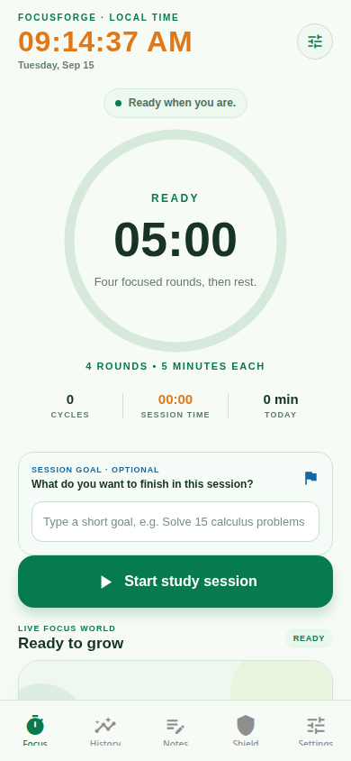
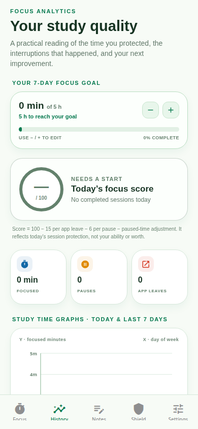
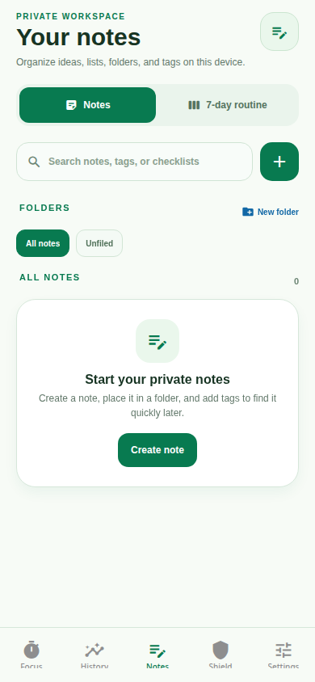
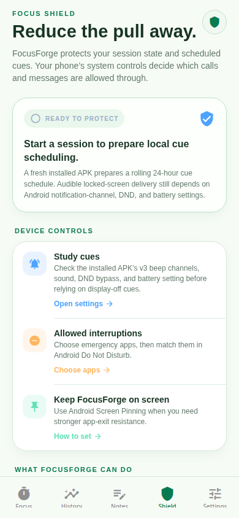
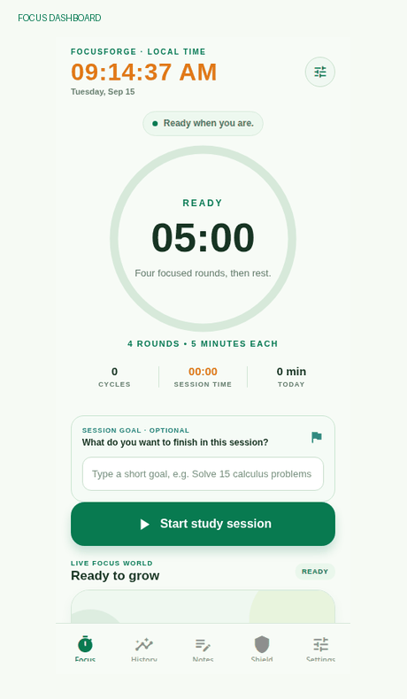

# FocusForge

<p align="center">
  <strong>A premium Android study timer for building consistent, interruption-resistant focus.</strong>
</p>

<p align="center">
  
  
  
  
</p>

FocusForge is a local-first productivity application built for students who want a calm, measurable study workflow. It combines a configurable focus timer, repeated audible cues, focus analytics, subject-based history, goals, private notes, routines, Android focus guidance, and lightweight animated growth worlds.

> **Project status:** The app is implemented as an Expo/React Native mobile project with Android release configuration, automated regression coverage, and a web preview for interface review.

## Product overview

FocusForge is designed around a simple study rhythm: complete several short focus rounds, receive clear audio cues at each boundary, take a scheduled rest, and continue until the session ends. The default rhythm is four five-minute focus rounds followed by a two-minute rest, while the rhythm designer allows users to create a custom routine.

The application is intentionally local-first. Sessions, goals, subject tags, notes, routines, preferences, growth progress, and analytics are persisted on the device. Android notification scheduling and Focus Shield guidance are used to improve reliability when the display is off, while the operating system remains responsible for final notification, battery, DND, and app-pinning enforcement.

## Interface visuals

### Focus dashboard

The dashboard presents the local clock, current timer state, round rhythm, focused-session time, optional session goal, and the primary start action in one focused flow. The live focus world appears below the session controls and progresses as the user completes rounds.


### History analytics

History turns completed sessions into practical feedback. It includes the seven-day focus goal, a focus-quality score, interruption and pause summaries, and coordinate-based charts for study time and recent behavior.


### Private notes and routine planning

The Notes workspace supports local notes, checklists, search, folders, tags, pinning, deletion confirmation, and a seven-day routine planner. A routine block can be used as a session goal so planning and execution remain connected.


### Focus Shield

Focus Shield explains the Android-specific controls that affect distraction reduction, including notification channels, Do Not Disturb configuration, allowed interruptions, battery behavior, and Screen Pinning. It communicates platform limitations instead of claiming that a normal Play-safe application can enforce kiosk-level restrictions.


### Product flow at a glance

This lightweight animated overview cycles through the main FocusForge workspaces and is intentionally optimized for repository documentation rather than in-app use.



## Core capabilities

| Capability | Implementation summary |
|---|---|
| Configurable study timer | Four sequential five-minute rounds by default, followed by a two-minute rest; custom rhythm design is supported. |
| Reliable cue flow | One cue at ordinary round boundaries, three cues at the rest boundary, and a new-cycle cue after rest. |
| Local session tracking | Sessions retain duration, subject, goal, completion state, pauses, interruptions, app leaves, and timestamps. |
| Study analytics | Seven-day goals, focus score, current-day event timelines, session-length charts, subject distributions, and improvement guidance. |
| Subject organization | Users can type and select custom subjects for current sessions and later review subject-level study time. |
| Notes and routines | Local notes, checklists, folders, tags, search, pinning, seven-day routines, and direct routine-to-focus actions. |
| Focus Shield | Android setup guidance for notification access, DND, allowed interruptions, battery settings, and Screen Pinning. |
| Growth worlds | Per-session Garden, Hive, or River selection with persistent 26-round visual progression and bounded motion. |
| Monetization-ready UI | Consent-aware advertising integration, loading placeholder, and optional rewarded ad flow that can provide twelve hours of local ad-free time. |
| Android delivery | Expo/EAS configuration supports APK testing and AAB preparation for Play Store release workflows. |

## Technology stack

| Layer | Technologies |
|---|---|
| Mobile framework | React Native 0.81.5 and Expo SDK 54 |
| Language | TypeScript 5.9 |
| Navigation | Expo Router 6 and React Navigation |
| Styling | NativeWind 4, Tailwind CSS, and shared theme tokens |
| Animation | React Native Reanimated 4 and React Native Worklets |
| Graphics | React Native SVG for lightweight scenes, charts, icons, and growth-world illustrations |
| Audio and device APIs | Expo Audio, Expo Notifications, Expo Haptics, Expo Keep Awake, Expo Secure Store, and Expo Build Properties |
| Persistence | AsyncStorage with local-first typed state management |
| Server foundation | Node.js, Express, tRPC, Drizzle ORM, and the project’s built-in server capabilities |
| Ads | React Native Google Mobile Ads with consent-aware runtime guards and test-ad configuration |
| Testing | Vitest regression tests and TypeScript static checking |
| Package management | pnpm |
| Android build | Expo prebuild, Gradle-compatible native configuration, EAS APK/AAB profiles |

## Architecture

The app follows a feature-oriented structure. The timer domain is separated from presentation, cue scheduling is isolated from audio replay, analytics are derived from persisted session records, and the growth scenes use bounded native-thread animation rather than JavaScript animation loops.

```text
app/
├── (tabs)/
│   ├── index.tsx              # Focus dashboard
│   ├── history.tsx            # Analytics and goals
│   ├── notes.tsx              # Notes and routine planner
│   ├── settings.tsx           # Audio, display, and app preferences
│   └── shield.tsx             # Android focus guidance
├── allowed-interruptions.tsx  # Emergency-app selection flow
└── rhythm-designer.tsx        # Custom session rhythm editor

components/
├── focusforge-ui.tsx          # Shared dashboard and interaction primitives
├── focus-history-charts.tsx   # History chart presentation
├── interactive-chart-frame.tsx# Gesture-aware chart frame
├── focus-ring.tsx             # Timer ring visualization
└── growth-theme/              # Garden, Hive, and River scenes

lib/
├── focusforge-core.ts         # Timer state machine and session rhythm
├── focusforge-provider.tsx    # Session lifecycle and persisted app state
├── focusforge-cue-schedule.ts # Local notification scheduling
├── cue-events.ts              # Cue transition events
├── cue-replay.ts              # Repeated audio replay logic
├── focusforge-analytics.ts    # Focus scores and chart data
├── focusforge-notes.ts        # Notes, tags, folders, and routines
├── focusforge-growth.ts       # Growth-world selection and progression
└── focusforge-notifications.ts# Platform notification behavior

tests/
├── focusforge-core.test.ts
├── cue-events.test.ts
├── cue-replay.test.ts
├── focusforge-analytics.test.ts
├── focusforge-growth.test.ts
├── focusforge-notes.test.ts
└── ...
```

## Local development

Install dependencies with pnpm, then start the Expo web preview:

```bash
pnpm install
pnpm dev
```

The default development command starts the Metro web preview. The managed project also contains the server foundation used by the template:

```bash
pnpm dev:server
```

Run the static and automated checks before opening a pull request or creating an Android checkpoint:

```bash
pnpm exec tsc --noEmit
pnpm test
```

The test suite covers timer transitions, repeated cue playback, notification scheduling, analytics, notes, monetization safeguards, allowed interruptions, session bubbles, and growth-world progression.

## Android build workflow

For an installable Android test build, use the project’s documented Expo/EAS workflow and build the preview profile as an APK. For Play Store submission, use the production profile to produce an AAB. The repository contains detailed guidance in [`ANDROID_SETUP.md`](ANDROID_SETUP.md), [`LOCAL_ANDROID_BUILD_DEBUG.md`](LOCAL_ANDROID_BUILD_DEBUG.md), and [`PLAY_STORE_RELEASE_CHECKLIST.md`](PLAY_STORE_RELEASE_CHECKLIST.md).

A typical local configuration check is:

```bash
npx expo config --type public
npx expo-doctor
```

The application is designed to remain Play-safe. Android system features such as Do Not Disturb, notification filtering, battery optimization, Screen Pinning, overlay access, and locked-screen delivery are subject to device and OS policy. FocusForge provides setup guidance and uses supported APIs; it does not claim unrestricted device-owner or kiosk enforcement in the standard build.

## Engineering highlights

FocusForge demonstrates several practical mobile engineering concerns in one project. The timer uses an explicit state sequence rather than deriving cues from approximate elapsed time. Audio replay is treated as a separate reliability problem from timer transitions. Session state is persisted and restored across app lifecycle changes. Analytics are computed from real session records instead of placeholder values. Charts use time-domain data and inspection interactions rather than static images. Growth-world animation is capped and pause-aware so visual polish does not require unbounded render work.

## Recruiter-ready summary

> Built **FocusForge**, a TypeScript-based React Native and Expo Android productivity application. Implemented configurable study cycles, repeated audio and notification cues, local persistence, session analytics, subject tagging, weekly goals, private notes, routine planning, Android focus guidance, lightweight Reanimated/SVG growth animations, consent-aware advertising, and automated Vitest coverage. Configured APK/AAB release workflows and resolved compatibility issues across Expo, React Native, Gradle, and native Android dependencies.

## Release status

The application is feature-complete for the current development scope, but public distribution still includes owner-controlled Android and Play Console work. The table below separates what is implemented in the repository from what must be completed with the owner’s signing credentials, production identifiers, and store account.

| Release area | Current status | Next action |
|---|---|---|
| Development preview | Ready | Open the managed preview and review the current UI flows. |
| TypeScript and automated tests | Passing: 53 passed, 1 skipped | Keep the checks green before each release checkpoint. |
| Android preview APK | Configuration prepared | Build a fresh APK and verify cues, pause/resume, session bubble, and locked-screen behavior on the target phone. |
| Play Store AAB | Production profile prepared | Generate a signed AAB through the managed publish workflow. |
| Production AdMob identifiers | Not yet owner-configured | Replace Google test IDs with production IDs and rerun consent and ad tests. |
| Privacy policy URL | Owner action required | Publish the policy at a stable public HTTPS URL and enter it in Play Console. |
| Play Console declarations | Owner action required | Complete Data safety, ads, content rating, target audience, and sensitive-permission declarations. |
| Internal testing | Owner action required | Upload the signed AAB to an internal testing track and verify on supported Android devices. |

## Contributing and issue reporting

FocusForge uses a feature-oriented TypeScript structure. Before making a change, read [`AI_HANDOFF.md`](AI_HANDOFF.md) and the relevant domain module. Keep timer transitions, cue scheduling, persistence, and UI rendering separated so a visual change does not silently alter study-session behavior.

For a focused contribution, create a branch, make one coherent change, add or update a deterministic Vitest test when behavior changes, and run `pnpm exec tsc --noEmit` followed by `pnpm test`. For visual work, capture the affected mobile route and confirm that the layout remains usable at portrait dimensions. Do not commit secrets, production AdMob identifiers, signing keys, local database credentials, or generated native build folders unless the release workflow explicitly requires them.

When reporting an issue, include the app version or checkpoint, device model and Android version, whether the build came from Expo Go, an APK, or an AAB, the exact reproduction steps, expected behavior, observed behavior, and relevant log output. For audio or locked-screen issues, also record notification permission, notification-channel state, DND access, battery optimization status, and whether the app was foregrounded or backgrounded.

## Related documentation

| Document | Purpose |
|---|---|
| [`AI_HANDOFF.md`](AI_HANDOFF.md) | Full architecture and safe update guide for future maintainers or AI agents |
| [`ANDROID_SETUP.md`](ANDROID_SETUP.md) | Android installation and device setup guidance |
| [`LOCAL_ANDROID_BUILD_DEBUG.md`](LOCAL_ANDROID_BUILD_DEBUG.md) | Windows and local Gradle troubleshooting workflow |
| [`PLAY_STORE_LISTING.md`](PLAY_STORE_LISTING.md) | Store listing copy and product positioning |
| [`PLAY_STORE_RELEASE_CHECKLIST.md`](PLAY_STORE_RELEASE_CHECKLIST.md) | Release readiness and owner-controlled Play Console steps |
| [`PRIVACY_POLICY.md`](PRIVACY_POLICY.md) | Privacy-policy draft for the local-first application |
| [`FOCUSFORGE_NEXT_FEATURES.md`](FOCUSFORGE_NEXT_FEATURES.md) | Prioritized ideas for future product development |

## License and ownership

This repository is maintained as a private FocusForge project. Before distributing the application publicly, confirm the final package identity, production advertising identifiers, privacy-policy URL, signing credentials, app-content declarations, and Play Console release configuration.
